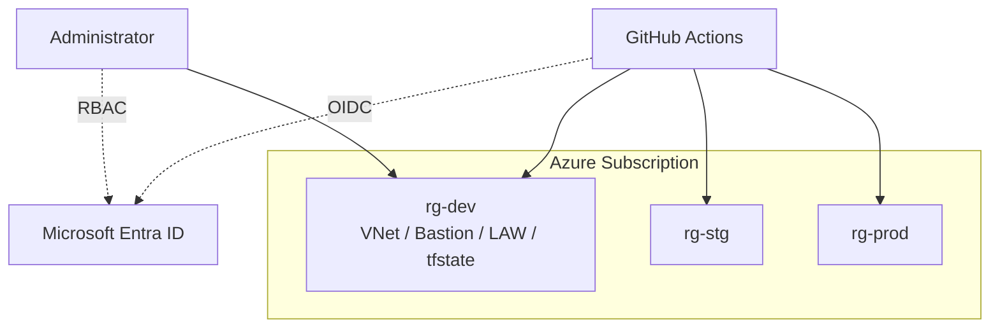
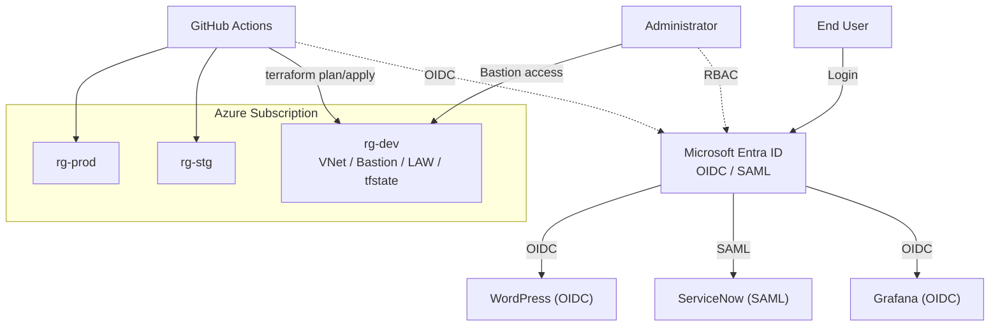
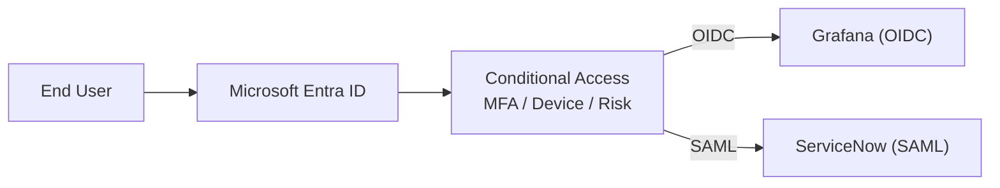

# Entra ID Platform（Azure × Terraform × SSO）

本リポジトリは、Microsoft Entra ID を中心とした Azure 基盤を  
Terraform + GitHub Actions（OIDC）で構築・運用するポートフォリオです。

---

# Phase 構成

## Phase1：IaC基盤

Terraform を用いた Azure 基盤を構築（IaC / CI/CD）

- modules / envs による構成分離
- dev / stg / prod 環境分離
- Azure Storage による remote backend
- Terraform state 分離管理
- Managed Identity + RBAC 設計
- GitHub Actions による CI/CD
  - Pull Request：terraform plan（matrix）
  - main push：terraform apply（dev）
- OIDC 認証によるセキュアな Azure 連携
- 証跡ベースの検証（docs/evidence）

---

## Phase2：Azure設計書

企業環境を想定した Azure 設計を整理。

- Architecture 設計
- Network 設計（VNet / Subnet / NSG / IP設計）
- RBAC 設計（最小権限 / GitHub Actions OIDC）
- Security 設計（Public IP 抑止 / Bastion / Log Analytics）
- Cost / 可用性設計

---

### Architecture Overview（概要図）

本環境では、GitHub Actions から OIDC を利用して Azure に認証し、  
Terraform により環境単位の基盤を管理します。

管理対象リソースには直接 Public IP を付与せず、  
Azure Bastion を経由した安全な管理経路を採用しています。



### Architecture Overview（SSO含む）




- 補足文
```md
Entra ID を ID プロバイダとして、Grafana（OIDC）/ ServiceNow（SAML）/ WordPress（OIDC）に対する SSO を提供する。
認証は Entra ID に集約し、将来的に Conditional Access / MFA / PIM を適用することで Zero Trust を強化する。
```

### SSO Overview

Microsoft Entra ID を Identity Provider として利用し、アプリケーションに対して Single Sign-On を提供します。

- Grafana：OpenID Connect（OIDC）
- ServiceNow：SAML

```md
flowchart LR
    User["End User"]
    Entra["Microsoft Entra ID"]
    Grafana["Grafana (OIDC)"]
    ServiceNow["ServiceNow (SAML)"]

    User --> Entra
    Entra -->|"OIDC"| Grafana
    Entra -->|"SAML"| ServiceNow
```

### 詳細設計

詳細な設計は以下ドキュメントを参照してください。

- docs/01-architecture.md
- docs/02-terraform.md
- docs/03-github-actions.md
- docs/04-entra-id.md
- docs/05-operations.md

### 設計のポイント

本構成では以下を重視しています。

- Public IP を使わないセキュアな管理経路（Bastion）
- OIDC によるシークレットレス認証
- Resource Group 単位の最小権限設計
- Terraform state の分離管理
- Log Analytics による監査・可観測性


### Evidence（証跡）

本プロジェクトでは、各フェーズの構築結果を証跡として保存しています。

- Infrastructure
  - Terraform plan / apply logs
  - Remote backend 設定確認
- CI/CD
  - GitHub Actions 実行ログ（OIDC認証含む）
- Identity / SSO
  - App Registration / Enterprise Application 設定
  - SSO 動作確認（Grafana / ServiceNow / WordPress）
- Security
  - RBAC 割り当て
  - Bastion 接続ログ
  - Log Analytics クエリ結果

📂 詳細は以下を参照：
- `docs/evidence/`
- `docs/evidence/phase1/`
- `docs/evidence/phase2/`
- `docs/evidence/phase3/`


### Design Principles（設計意図）

本構成は、学習用途でありながら実務設計に準拠することを目的としている。

#### 1. Secure by Design
- 管理対象リソースに Public IP を付与しない
- 管理経路は Azure Bastion に集約
- Entra ID を中心に認証を統一

#### 2. Identity First（Zero Trust前提）
- すべての認証は Entra ID を起点
- OIDC / SAML による SSO を標準化
- 将来的に Conditional Access / MFA / PIM を適用

#### 3. Least Privilege
- RBAC は Resource Group スコープ中心
- GitHub Actions は OIDC + 最小権限
- 人手運用と自動化の権限を分離

#### 4. IaC & GitOps
- Terraform による再現性のある構築
- dev / stg / prod の環境分離
- Pull Request ベースで plan を可視化

#### 5. Observability
- Log Analytics にログを集約
- Bastion / Activity Log / SSO ログを横断的に分析可能

#### 6. Cost-Aware Design
- 必要十分な構成でコストを最適化
- Bastion 等は価値を優先しつつ、未使用時の削除/再作成も考慮
- 将来の可用性拡張（Zone/DR）を前提に設計


## Phase3：Entra ID設計（次フェーズ）

Identity / SSO 基盤を構築。

- Conditional Access
- MFA 強制
- Access Reviews
- PIM
- SSO（OIDC / SAML）

### SSO / Conditional Access Overview

Azure × Terraform × Entra ID により、SSO（OIDC/SAML）・Conditional Access・RBAC を統合した実務レベルのクラウド認証基盤を設計・構築



Entra ID を中心に認証を統一し、Conditional Access により MFA・リスクベース制御を適用する。
これにより、SSO と Zero Trust を両立した認証基盤を実現する。

- Grafana（OIDC）ログイン成功
- ServiceNow（SAML）ログイン成功
- Conditional Access ポリシー適用
- MFA チャレンジ確認

📂 詳細：
- `docs/evidence/phase3/grafana/`
- `docs/evidence/phase3/servicenow/`
- `docs/evidence/phase3/conditional-access/`


## Phase4：運用設計（予定）

運用フェーズを想定したドキュメント整備。

- 証跡整理
- トラブルシュート集
- 運用手順書
- インシデント対応フロー


