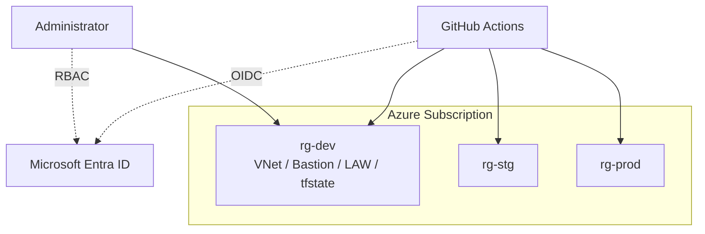
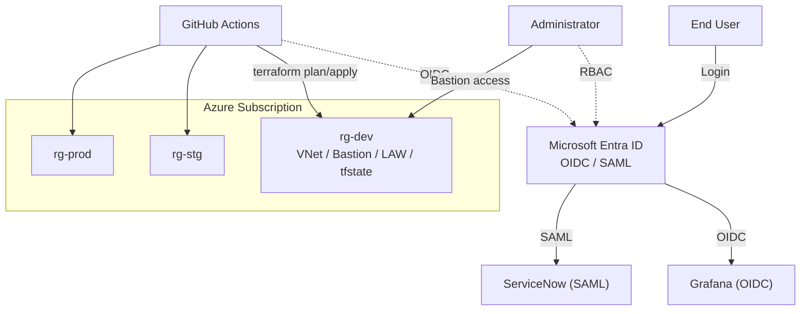
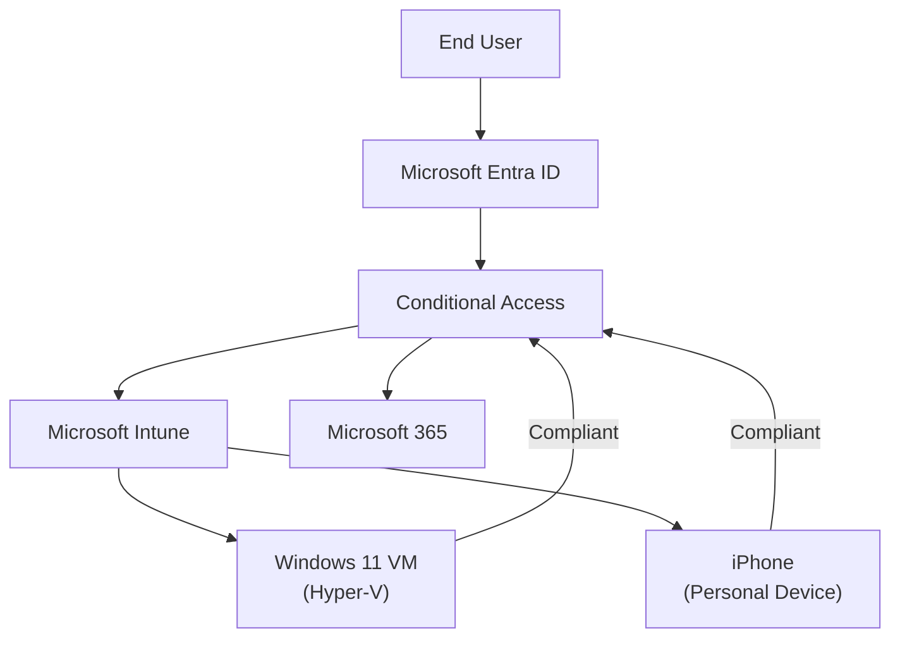
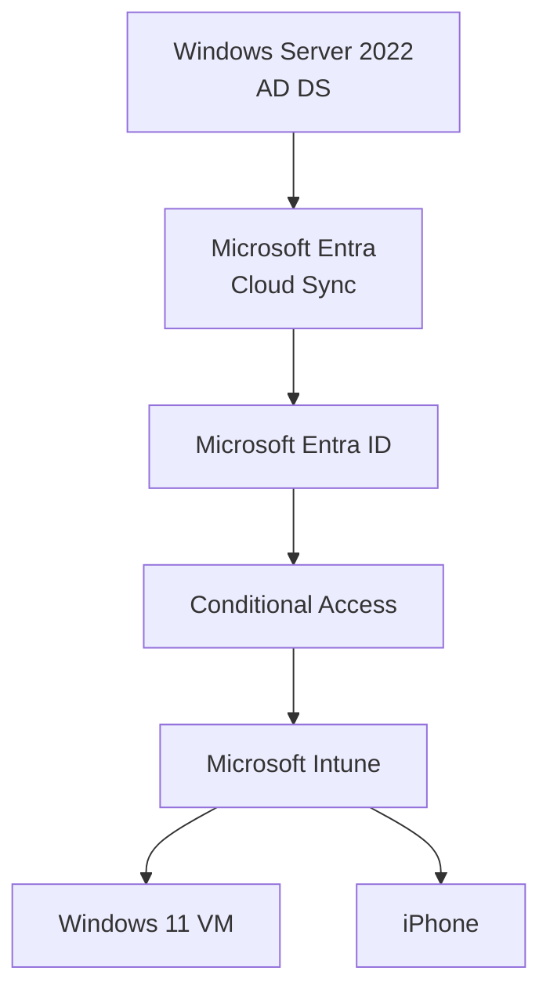
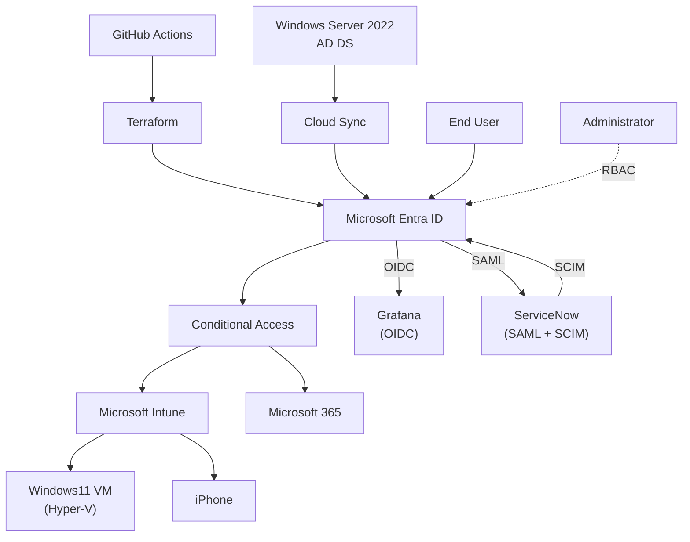

# Entra ID Platform（Azure × Terraform × SSO × Intune × Hybrid Identity）

本リポジトリは、Microsoft Entra ID を中心とした認証基盤・SSO・Intune・Hybrid Identity の設計・構築・運用を実践するポートフォリオです。

Terraform と GitHub Actions（OIDC）を利用して Azure 基盤を構築し、Microsoft Entra ID を中心とした Identity Platform を実装します。

---

# 🎯 このポートフォリオの価値

本構成は以下を実現します。

* IaC（Terraform）による再現性
* GitHub Actions + OIDC による CI/CD
* Microsoft Entra ID を中心とした認証統合
* Conditional Access による Zero Trust
* Microsoft Intune によるデバイス管理
* ServiceNow SCIM Provisioning
* Self-Service Password Reset（SSPR）
* Windows Hello for Business（WHfB）
* Microsoft Defender
* ID Lifecycle Management
* PowerShell / Graph API 自動化
* Hybrid Identity（AD DS + Cloud Sync）
* Migration / Rollback 設計

👉 認証 + デバイス + 制御 + 運用 + 自動化 を一貫して設計・構築

---

# 技術スタック

## Infrastructure as Code

* Terraform
* GitHub Actions
* OIDC Federation

## Identity

* Microsoft Entra ID
* Conditional Access
* MFA
* SSPR
* Windows Hello for Business
* Cloud Sync

## SSO

* OpenID Connect (OIDC)
* SAML 2.0
* SCIM Provisioning

## Device Management

* Microsoft Intune
* Compliance Policy
* Device Control
* Mobile Application Management

## Security

* Microsoft Defender for Endpoint
* Managed Identity
* Zero Trust

## Automation

* PowerShell
* Microsoft Graph API
* Task Scheduler

## Hybrid Identity

* Windows Server 2022
* Active Directory Domain Services
* Microsoft Entra Cloud Sync

---

# Architecture Overview（IaC基盤）

本環境では Terraform と GitHub Actions を利用し、Azure リソースを Infrastructure as Code（IaC）として管理しています。

GitHub Actions から OIDC を利用して Azure に認証し、シークレットレスで Terraform を実行します。

環境は dev / stg / prod に分離し、Managed Identity と RBAC により最小権限のアクセス制御を実装しています。

Azure Bastion を利用することで、Public IP を公開せずに安全な管理経路を確保しています。


```mermaid
flowchart TB
    Admin["Administrator"]
    GHA["GitHub Actions"]
    Entra["Microsoft Entra ID"]

    subgraph Azure["Azure Subscription"]
        DEV["rg-dev<br/>VNet / Bastion / LAW / tfstate"]
        STG["rg-stg"]
        PROD["rg-prod"]
    end

    Admin -. RBAC .-> Entra
    GHA -. OIDC .-> Entra

    Admin --> DEV
    GHA --> DEV
    GHA --> STG
    GHA --> PROD
```

---

# SSO Overview（OIDC / SAML）

Microsoft Entra ID を Identity Provider（IdP）として利用し、複数の業務アプリケーションへシングルサインオンを提供します。

OIDC と SAML の両方を実装対象とし、Grafana と ServiceNow を例に認証統合を実施します。

将来的には Conditional Access、MFA、リスクベース認証を組み合わせることで Zero Trust アーキテクチャを実現します。


```mermaid
flowchart TB
    Admin["Administrator"]
    User["End User"]
    GHA["GitHub Actions"]
    Entra["Microsoft Entra ID<br/>OIDC / SAML"]

    Grafana["Grafana (OIDC)"]
    ServiceNow["ServiceNow (SAML)"]

    subgraph Azure["Azure Subscription"]
        DEV["rg-dev<br/>VNet / Bastion / LAW / tfstate"]
        STG["rg-stg"]
        PROD["rg-prod"]
    end

    Admin -. RBAC .-> Entra
    GHA -. OIDC .-> Entra

    GHA -->|"terraform plan/apply"| DEV
    GHA --> STG
    GHA --> PROD

    Admin -->|"Bastion access"| DEV

    User -->|"Login"| Entra

    Entra -->|"OIDC"| Grafana
    Entra -->|"SAML"| ServiceNow
```

---

# Intune Overview

Microsoft Intune を利用し、Windows 11 および iPhone を対象としたデバイス管理を実施します。

本ポートフォリオでは Hyper-V 上の Windows 11 仮想マシンと実機 iPhone を利用し、Enrollment、Compliance Policy、Conditional Access、MAM（Mobile Application Management）を検証します。

企業における BYOD と社給端末の両方を想定した設計を学習します。


```mermaid
flowchart TB

    User["End User"]

    Entra["Microsoft Entra ID"]

    CA["Conditional Access"]

    Intune["Microsoft Intune"]

    Win11["Windows 11 VM<br/>(Hyper-V)"]

    iPhone["iPhone<br/>(Personal Device)"]

    M365["Microsoft 365"]

    User --> Entra

    Entra --> CA

    CA --> Intune

    Intune --> Win11
    Intune --> iPhone

    Win11 -->|"Compliant"| CA
    iPhone -->|"Compliant"| CA

    CA --> M365
```

---

# Hybrid Identity Overview

オンプレミス Active Directory と Microsoft Entra ID を連携し、ハイブリッド ID 基盤を構築します。

Windows Server 2022 上に Active Directory Domain Services を構築し、Microsoft Entra Cloud Sync を利用してユーザー情報を同期します。

多くの企業で採用されている構成を再現し、クラウド認証とオンプレミス認証の連携を学習します。


```mermaid
flowchart TB

    AD["Windows Server 2022<br/>AD DS"]

    Sync["Microsoft Entra<br/>Cloud Sync"]

    Entra["Microsoft Entra ID"]

    CA["Conditional Access"]

    Intune["Microsoft Intune"]

    Win11["Windows 11 VM"]

    iPhone["iPhone"]

    AD --> Sync

    Sync --> Entra

    Entra --> CA

    CA --> Intune

    Intune --> Win11
    Intune --> iPhone
```

---

# Target Architecture（最終完成形）

本ポートフォリオの最終目標構成です。

Terraform により Azure 基盤を管理し、Microsoft Entra ID を中心として SSO、Conditional Access、Intune、SCIM Provisioning、Hybrid Identity を統合します。

認証基盤の設計・構築だけでなく、運用自動化、移行計画、ロールバック設計まで含めた実務レベルのポートフォリオを目指しています。



```mermaid
flowchart TB

    Admin["Administrator"]

    User["End User"]

    GHA["GitHub Actions"]

    Terraform["Terraform"]

    AD["Windows Server 2022<br/>AD DS"]

    Sync["Cloud Sync"]

    Entra["Microsoft Entra ID"]

    CA["Conditional Access"]

    Intune["Microsoft Intune"]

    Grafana["Grafana<br/>(OIDC)"]

    ServiceNow["ServiceNow<br/>(SAML + SCIM)"]

    Win11["Windows11 VM<br/>(Hyper-V)"]

    iPhone["iPhone"]

    M365["Microsoft 365"]

    GHA --> Terraform

    Terraform --> Entra

    AD --> Sync

    Sync --> Entra

    User --> Entra

    Entra --> CA

    CA --> Intune

    Intune --> Win11
    Intune --> iPhone

    Entra -->|"OIDC"| Grafana

    Entra -->|"SAML"| ServiceNow

    ServiceNow -->|"SCIM"| Entra

    CA --> M365

    Admin -. RBAC .-> Entra
```

---

### IaC基盤

* Terraform Backend
* Resource Group
* Virtual Network
* Subnet
* Network Security Group
* Managed Identity
* GitHub Actions
* OIDC Federation

### ドキュメント

* 要件定義
* 基本設計
* セキュリティ設計
* テスト計画
* 移行計画

---

# 実装ロードマップ

## Phase1：SSO基盤

Microsoft Entra ID を中心とした認証基盤を構築します。

独自ドメインを利用した認証環境を整備し、Grafana（OIDC）および ServiceNow（SAML）との SSO を実装します。

また Conditional Access を適用し、Zero Trust の基礎となる認証制御を構築します。

* DNS Verified
* Grafana OIDC
* ServiceNow SAML
* Conditional Access

## Phase2：Zero Trust / Endpoint Management

Microsoft Intune を利用し、端末管理とアクセス制御を実装します。

Compliance Policy、Device Control、Windows Hello for Business、SSPR、MAM を組み合わせることで、認証と端末の両面からセキュリティを強化します。

* Intune
* Compliance Policy
* Device Control
* WHfB
* SSPR
* MAM

## Phase2.5：Intune Device Management Lab

Windows 11 仮想マシンと実機 iPhone を利用して Intune の運用を再現します。

企業で利用される Windows 端末管理とモバイルデバイス管理（MDM/MAM）の両方を検証し、Apple Business Manager や ADE についても設計レベルで理解を深めます。

* Windows 11 Enrollment
* iPhone Enrollment
* iOS Compliance
* iOS Conditional Access
* App Protection Policy
* Device Retire
* Apple Business Manager設計
* ADE設計

## Phase3：運用設計

システム構築後の運用を想定したフェーズです。

ID Lifecycle Management、SCIM Provisioning、Defender、SSO 障害対応、ロールバック設計を実施し、運用フェーズで求められる知識を体系的に整理します。

* Lifecycle Management
* SCIM Provisioning
* Defender
* Rollback設計
* SSO障害対応

## Phase4：移行・監査

既存環境から新環境への移行を想定し、移行計画やロールバック計画を策定します。

KQL を利用した監査ログ分析や Hybrid Identity 移行シナリオを作成し、実際のプロジェクトで必要となる移行設計を学習します。

* Migration
* KQL監査
* Hybrid移行シナリオ

## Phase5：運用自動化

PowerShell と Microsoft Graph API を利用し、運用作業の自動化を実装します。

ライセンス付与、ユーザー管理、Exchange Online、SharePoint Online の運用を自動化し、運用負荷の削減と標準化を目指します。

* PowerShell Automation
* Graph API Automation
* Exchange Online Automation
* SharePoint Online Automation
* Teams運用
* Power Automate

## Phase6：Hybrid Identity

Windows Server 2022 を利用して Active Directory を構築し、Microsoft Entra Cloud Sync と連携します。

オンプレミスとクラウドを統合した Hybrid Identity 環境を構築し、実企業で一般的な ID 基盤を再現します。

* AD DS
* Cloud Sync
* Hybrid Identity
* AD → Entra移行

```
```


