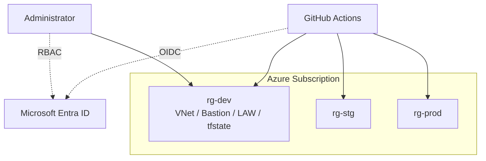
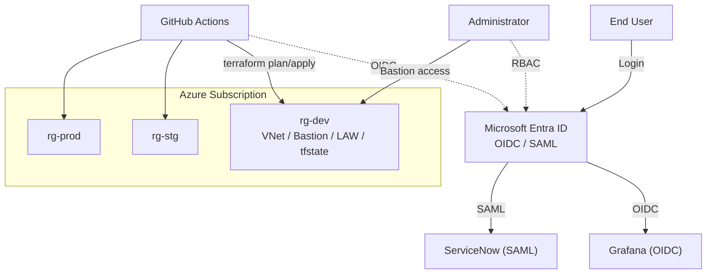
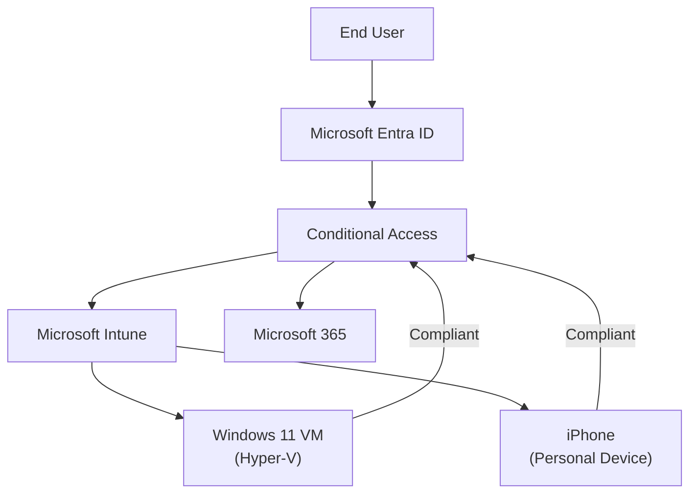
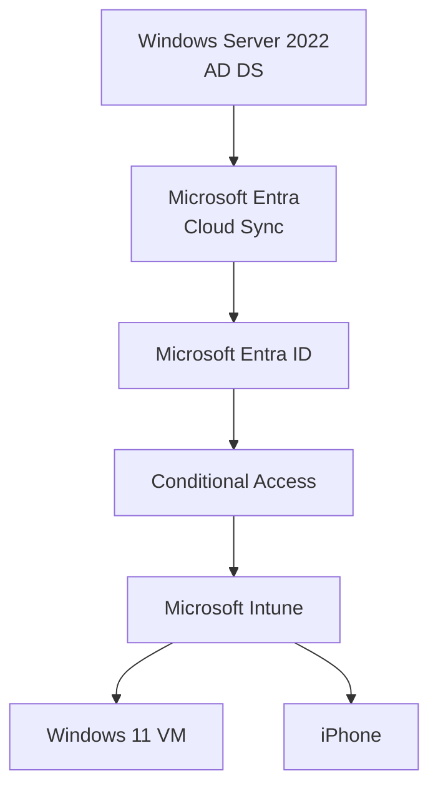
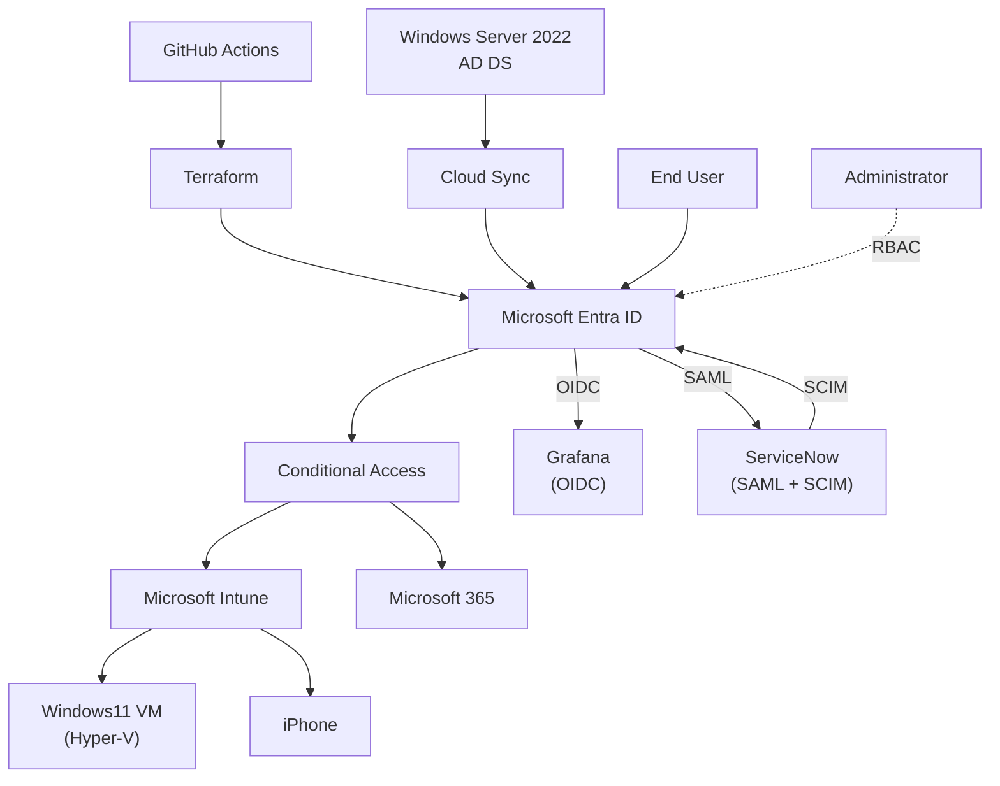

# Entra ID Platform（Azure × Terraform × SSO × Intune × Hybrid Identity）

本リポジトリは、Microsoft Entra ID を中心とした認証基盤・SSO・Intune・Hybrid Identity の設計・構築・運用を実践するポートフォリオです。

Terraform と GitHub Actions（OIDC）を利用して Azure 基盤を構築し、Microsoft Entra ID を中心とした Identity Platform を実装します。

---

# 🎯 このポートフォリオの価値

本構成は以下を実現します。

* IaC（Terraform）による再現性
* GitHub Actions + OIDC による CI/CD
* Microsoft Entra ID を中心とした認証統合
* Conditional Access による Zero Trust
* Microsoft Intune によるデバイス管理
* ServiceNow SCIM Provisioning
* Self-Service Password Reset（SSPR）
* Windows Hello for Business（WHfB）
* Microsoft Defender
* ID Lifecycle Management
* PowerShell / Graph API 自動化
* Hybrid Identity（AD DS + Cloud Sync）
* Migration / Rollback 設計

👉 認証 + デバイス + 制御 + 運用 + 自動化 を一貫して設計・構築

---

# 技術スタック

## Infrastructure as Code

* Terraform
* GitHub Actions
* OIDC Federation

## Identity

* Microsoft Entra ID
* Conditional Access
* MFA
* SSPR
* Windows Hello for Business
* Cloud Sync

## SSO

* OpenID Connect (OIDC)
* SAML 2.0
* SCIM Provisioning

## Device Management

* Microsoft Intune
* Compliance Policy
* Device Control
* Mobile Application Management

## Security

* Microsoft Defender for Endpoint
* Managed Identity
* Zero Trust

## Automation

* PowerShell
* Microsoft Graph API
* Task Scheduler

## Hybrid Identity

* Windows Server 2022
* Active Directory Domain Services
* Microsoft Entra Cloud Sync

---

# Architecture Overview（IaC基盤）


```mermaid
flowchart TB
    Admin["Administrator"]
    GHA["GitHub Actions"]
    Entra["Microsoft Entra ID"]

    subgraph Azure["Azure Subscription"]
        DEV["rg-dev<br/>VNet / Bastion / LAW / tfstate"]
        STG["rg-stg"]
        PROD["rg-prod"]
    end

    Admin -. RBAC .-> Entra
    GHA -. OIDC .-> Entra

    Admin --> DEV
    GHA --> DEV
    GHA --> STG
    GHA --> PROD
```

---

# SSO Overview（OIDC / SAML）


```mermaid
flowchart TB
    Admin["Administrator"]
    User["End User"]
    GHA["GitHub Actions"]
    Entra["Microsoft Entra ID<br/>OIDC / SAML"]

    Grafana["Grafana (OIDC)"]
    ServiceNow["ServiceNow (SAML)"]

    subgraph Azure["Azure Subscription"]
        DEV["rg-dev<br/>VNet / Bastion / LAW / tfstate"]
        STG["rg-stg"]
        PROD["rg-prod"]
    end

    Admin -. RBAC .-> Entra
    GHA -. OIDC .-> Entra

    GHA -->|"terraform plan/apply"| DEV
    GHA --> STG
    GHA --> PROD

    Admin -->|"Bastion access"| DEV

    User -->|"Login"| Entra

    Entra -->|"OIDC"| Grafana
    Entra -->|"SAML"| ServiceNow
```

---

# Intune Overview


```mermaid
flowchart TB

    User["End User"]

    Entra["Microsoft Entra ID"]

    CA["Conditional Access"]

    Intune["Microsoft Intune"]

    Win11["Windows 11 VM<br/>(Hyper-V)"]

    iPhone["iPhone<br/>(Personal Device)"]

    M365["Microsoft 365"]

    User --> Entra

    Entra --> CA

    CA --> Intune

    Intune --> Win11
    Intune --> iPhone

    Win11 -->|"Compliant"| CA
    iPhone -->|"Compliant"| CA

    CA --> M365
```

---

# Hybrid Identity Overview


```mermaid
flowchart TB

    AD["Windows Server 2022<br/>AD DS"]

    Sync["Microsoft Entra<br/>Cloud Sync"]

    Entra["Microsoft Entra ID"]

    CA["Conditional Access"]

    Intune["Microsoft Intune"]

    Win11["Windows 11 VM"]

    iPhone["iPhone"]

    AD --> Sync

    Sync --> Entra

    Entra --> CA

    CA --> Intune

    Intune --> Win11
    Intune --> iPhone
```

---

# Target Architecture（最終完成形）


```mermaid
flowchart TB

    Admin["Administrator"]

    User["End User"]

    GHA["GitHub Actions"]

    Terraform["Terraform"]

    AD["Windows Server 2022<br/>AD DS"]

    Sync["Cloud Sync"]

    Entra["Microsoft Entra ID"]

    CA["Conditional Access"]

    Intune["Microsoft Intune"]

    Grafana["Grafana<br/>(OIDC)"]

    ServiceNow["ServiceNow<br/>(SAML + SCIM)"]

    Win11["Windows11 VM<br/>(Hyper-V)"]

    iPhone["iPhone"]

    M365["Microsoft 365"]

    GHA --> Terraform

    Terraform --> Entra

    AD --> Sync

    Sync --> Entra

    User --> Entra

    Entra --> CA

    CA --> Intune

    Intune --> Win11
    Intune --> iPhone

    Entra -->|"OIDC"| Grafana

    Entra -->|"SAML"| ServiceNow

    ServiceNow -->|"SCIM"| Entra

    CA --> M365

    Admin -. RBAC .-> Entra
```

---

# Current Status

## 完了

### IaC基盤

* Terraform Backend
* Resource Group
* Virtual Network
* Subnet
* Network Security Group
* Managed Identity
* GitHub Actions
* OIDC Federation

### ドキュメント

* 要件定義
* 基本設計
* セキュリティ設計
* テスト計画
* 移行計画

---

## 実施中

### DNS / Domain

対象ドメイン

entra-id-platform.com

実施内容

* ドメイン取得
* DNS設計
* Entra Custom Domain
* DNS Verification

---

# 実装ロードマップ

## Phase1

* DNS Verified
* Grafana OIDC
* ServiceNow SAML
* Conditional Access

## Phase2

* Intune
* Compliance Policy
* Device Control
* WHfB
* SSPR
* MAM

## Phase2.5

* Windows 11 Enrollment
* iPhone Enrollment
* iOS Compliance
* iOS Conditional Access
* App Protection Policy
* Device Retire
* Apple Business Manager設計
* ADE設計

## Phase3

* Lifecycle Management
* SCIM Provisioning
* Defender
* Rollback設計
* SSO障害対応

## Phase4

* Migration
* KQL監査
* Hybrid移行シナリオ

## Phase5

* PowerShell Automation
* Graph API Automation
* Exchange Online Automation
* SharePoint Online Automation
* Teams運用
* Power Automate

## Phase6

* AD DS
* Cloud Sync
* Hybrid Identity
* AD → Entra移行

```
```


