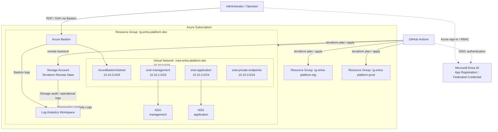

# Azure Architecture

## 1. 目的
本ドキュメントは、`entra-id-platform` における Azure 基盤の全体アーキテクチャを定義する。  
本環境は学習用途を含むが、構成思想は企業環境を意識し、**環境分離・最小権限・安全な管理経路・監査性・拡張性** を重視する。

## 2. 設計方針
- 環境は `dev / stg / prod` で分離する
- Terraform により Azure リソースをコード管理する
- Terraform state は remote backend で一元管理する
- CI/CD は GitHub Actions + OIDC で Azure に接続する
- 管理対象リソースへの直接 Public IP 付与は原則避ける
- Azure Bastion などの安全な管理経路を優先する
- 監査ログ・操作証跡を残せる設計にする
- 小規模でも、本番へ拡張しやすい設計単位を採用する

## 3. 全体構成
Azure 基盤は、主に以下の論理要素で構成する。

- Subscription
- Resource Group
- Network
  - Virtual Network
  - Subnet
  - Network Security Group
- Management
  - Azure Bastion
  - Log Analytics Workspace
- Identity / Access
  - Microsoft Entra ID
  - App Registration / Enterprise Application
  - RBAC
- Storage
  - Terraform remote state 用 Storage Account
- CI/CD
  - GitHub Actions
  - OIDC Federated Credential

## 4. 想定アーキテクチャ図

### 4.1 図1：Azure 全体アーキテクチャ図

本構成では、GitHub Actions から OIDC を利用して Azure に認証し、Terraform により環境単位の基盤を管理する。
管理対象リソースには原則として直接 Public IP を付与せず、Azure Bastion を経由して管理する。
また、Terraform state は Azure Storage の remote backend で環境ごとに分離し、診断ログや操作ログは Log Analytics Workspace に集約する。

### 4.2 図2：Azure ネットワーク詳細図

VNet は環境単位で作成し、AzureBastionSubnet、管理用、アプリ用、Private Endpoint 用の各サブネットに分割する。
これにより、管理トラフィックと業務トラフィックを分離し、NSG による最小許可設計を適用しやすくしている。
また、管理対象 VM には直接 Public IP を付与せず、Azure Bastion を唯一の管理経路としている。

## 5. Architecture 設計

### 5.1 環境分離

環境は dev / stg / prod を前提とする。
これにより、以下を実現する。

- 変更影響範囲の局所化
- 検証と本番相当環境の分離
- plan / apply の対象明確化
- state の分離管理

初期段階では dev を先行実装し、stg / prod は同一設計で横展開可能とする。

### 5.2 Resource Group 設計

現段階では、環境単位での Resource Group 分離 を基本とする。
理由は以下のとおり。

- Terraform の責務境界が分かりやすい
- 権限スコープを絞りやすい
- 学習・検証・レビューの導線が明確
- 将来的に network / security / app 単位に再分割しやすい

例:

- rg-entra-platform-dev
- rg-entra-platform-stg
- rg-entra-platform-prod

### 5.3 管理経路設計

管理経路は、原則として以下を目指す。

- 管理対象 VM への Public IP 直接付与を避ける
- Azure Bastion 経由で RDP / SSH を行う
- Azure Portal / Entra ID / RBAC による管理者認証を前提とする

これは、実務で重要な次の要件に沿う。

- 外部公開面の最小化
- 管理経路の一元化
- 監査しやすい接続方式

## 6. Network 設計

### 6.1 VNet 設計方針

VNet は環境単位で作成する。
例として dev 環境では、以下のようなアドレス空間を想定する。

10.10.0.0/16

このように /16 を確保する理由は以下のとおり。

- 将来のサブネット追加余地を確保するため
- 現時点では小規模でも、本番想定に近い設計にするため
- 管理用・アプリ用・Private Endpoint 用を無理なく分離するため

## 6.2 Subnet 設計例

Subnet名	用途	CIDR
AzureBastionSubnet	Azure Bastion 専用	10.10.0.0/26
snet-management	管理系リソース用	10.10.1.0/24
snet-application	アプリケーション系用	10.10.2.0/24
snet-private-endpoints	将来拡張用	10.10.3.0/24

## 6.3 分離意図

Subnet を分ける主な理由は以下のとおり。

- 管理トラフィックと業務トラフィックを分離するため
- NSG 制御の単位を明確にするため
- Private Endpoint など将来の閉域接続拡張に備えるため
- 「1サブネットに全部載せる」ラボ構成から脱却するため

## 7. Security 設計

### 7.1 Public IP 方針

原則として、管理対象 VM には Public IP を付与しない。
理由は以下のとおり。

- 外部公開面を減らす
- NSG の複雑な直接公開制御を避ける
- Bastion などの一元管理方式へ寄せる
- 実務で説明しやすい「閉じた管理経路」を採用する

### 7.2 NSG 方針

NSG は最小許可を前提とする。
代表的な考え方は以下。

- 管理系サブネット: 必要な管理通信のみ
- アプリ系サブネット: 必要ポートのみ公開
- Private Endpoint 用サブネット: 原則閉域前提

## 7.3 ログ・監査

ログ・監査性の観点から、以下を前提とする。

- Azure Activity Log を確認できること
- 重要リソースの診断ログを Log Analytics Workspace に集約すること
- Bastion 利用時は接続証跡を確認可能にすること
- 将来は Entra Sign-in Logs / Audit Logs と関連づけて分析可能な形に拡張すること

## 8. RBAC 設計

### 8.1 RBAC の基本方針

- 最小権限を原則とする
- 人手運用と自動化運用の権限を分離する
- 可能な限り Subscription 全体ではなく、対象 Resource Group に限定して権限を付与する

### 8.2 想定ロール

対象	想定ロール	スコープ	用途
Platform Admin	Contributor	対象 RG	Terraform 管理、基盤変更
Reviewer	Reader	RG / Subscription	設計レビュー、証跡確認
GitHub Actions OIDC	Contributor	対象 RG	plan / apply 実行
Monitoring Viewer	Reader / Log Analytics Reader	LAW	ログ参照

### 8.3 設計意図

Contributor を Subscription 全体に付与せず、対象 RG に絞ることが重要である。
これにより、以下を実現する。

- 誤操作範囲の限定
- 権限レビューの簡素化
- 「必要な範囲だけ管理する」実務型設計

## 9. Cost / 可用性設計

### 9.1 コスト設計方針

本環境は検証・ポートフォリオ用途を含むため、無制限に本番同等の冗長化は行わない。
一方で、単なる最安構成ではなく、実務説明に耐える選択を行う。

コスト影響が大きい要素:

- Azure Bastion
- Virtual Machine
- Log Analytics 取り込み量
- ストレージ
- 将来的なバックアップや監視追加

### 9.2 コスト最適化の考え方

- 利用しない検証 VM は停止する
- Bastion は必要性を設計書で説明し、未使用時は削除・再作成戦略も検討する
- Log Analytics は保持期間・収集対象を過剰にしない
- SKU は「必要十分」を原則とする

### 9.3 可用性設計方針

現段階では以下の割り切りを置く。

- 単一リージョン構成
- 限定的な冗長化
- 学習・検証用途として、短時間停止を許容
- ただし、将来的に Zone 冗長・Backup・DR に拡張できる設計単位を維持する

### 9.4 実務での説明ポイント

この構成の価値は、「最初からフル冗長」ではなく、コストを抑えつつ設計思想を本番に寄せていることにある。
面接やレビューでは、以下を説明できるようにする。

- なぜ今は単一リージョンなのか
- なぜ Bastion を使うのか
- なぜ Public IP を避けるのか
- なぜ環境分離と RG 単位権限制御を重視するのか

### 10. この設計の到達点

本ドキュメントにより、Azure 基盤について次を説明できる状態を目指す。

- 全体構成
- ネットワーク分離意図
- 権限設計意図
- セキュリティ方針
- コストと可用性のトレードオフ

これは「動く Terraform」から一段上がり、Azure 設計を言語化できる状態を示すための中核ドキュメントである。

