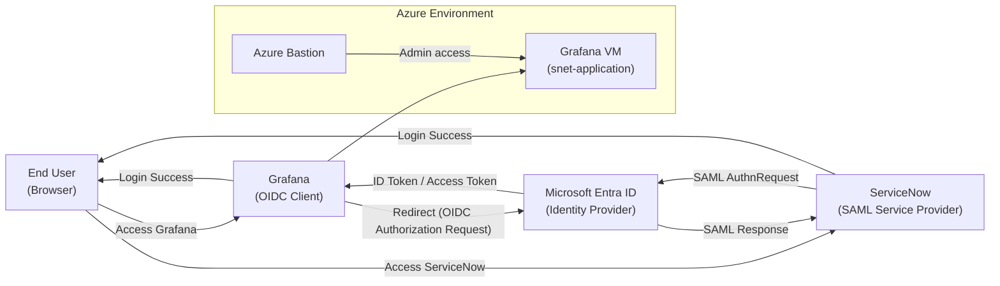
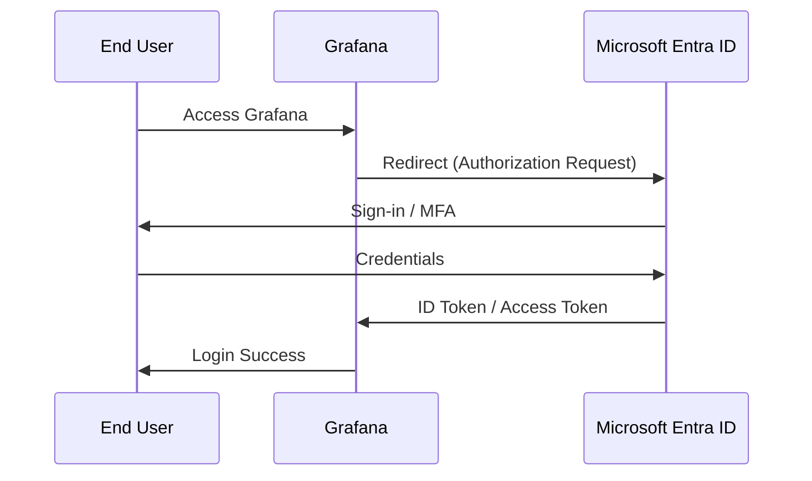
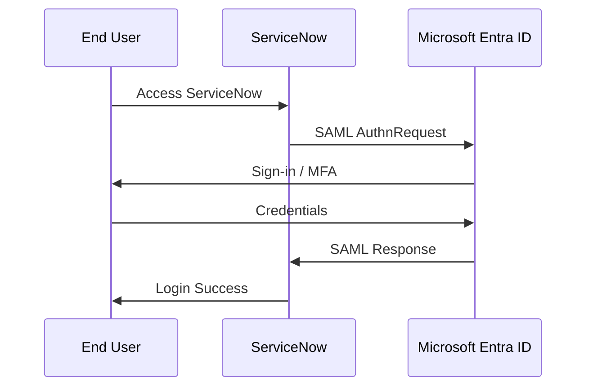

# Entra ID Design

## 1. 目的
本ドキュメントは、`entra-id-platform` における Microsoft Entra ID を中心とした認証・SSO 設計を定義する。  
本フェーズでは、Entra ID を Identity Provider（IdP）として利用し、Grafana と ServiceNow に対して Single Sign-On（SSO）を提供する構成を整理する。

対象プロトコルは以下とする。

- Grafana: OpenID Connect（OIDC）
- ServiceNow: Security Assertion Markup Language（SAML）

本構成により、認証を Entra ID に集約し、将来的な Conditional Access、MFA、PIM などの Zero Trust 強化につなげる。

## 2. 設計方針
- 認証基盤は Microsoft Entra ID に集約する
- アプリケーション特性に応じて OIDC / SAML を使い分ける
- SSO を前提とし、アプリ個別認証を極力持たない
- 将来的な Conditional Access / MFA 強制を前提とする
- Azure 基盤側の管理経路と、アプリケーション認証経路を分離して整理する
- 構築だけでなく、認証フローを説明できる状態を目指す

## 3. SSO Architecture

### 3.1 全体図（Grafana / ServiceNow）

本構成では、Microsoft Entra ID を Identity Provider（IdP）として利用し、複数アプリケーションに対して SSO を提供する。
Grafana は OIDC クライアントとして動作し、Entra ID からトークンを受け取って認証する。
ServiceNow は SAML Service Provider（SP）として動作し、Entra ID からの SAML レスポンスを用いて認証する。

## 4. OIDC Flow（Grafana）

### 4.1 シーケンス図

### 4.2 設計意図

Grafana では OIDC を採用する。
理由は以下のとおり。

- Web アプリケーションとの親和性が高い
- トークンベースでの認証・属性連携がしやすい
- Entra ID との統合事例が多い
- Conditional Access / MFA 適用時にも拡張しやすい

### 4.3 想定する属性連携

Grafana 側では、必要に応じて以下の属性を利用する。

- userPrincipalName
- displayName
- email

実装時は、Grafana 側の auth.generic_oauth 設定にて、ログイン属性・表示名属性・メール属性を適切にマッピングする。

## 5. SAML Flow（ServiceNow）

### 5.1 シーケンス図

### 5.2 設計意図

ServiceNow では SAML を採用する。
理由は以下のとおり。

- エンタープライズ製品との連携実績が多い
- ServiceNow 側の SSO 実装として一般的
- OIDC ではなく SAML 前提で整理された環境でも適用しやすい
- Entra ID を IdP とした標準的な企業内 SSO 構成を示しやすい

### 5.3 想定する属性連携

ServiceNow 側では、NameID やメール属性を利用してユーザーを識別する。
実装時は、以下の整合性が重要となる。

- Entra ID 側の NameID 設定
- ServiceNow 側の User Field
- メールアドレス / UPN のどちらを識別子にするか

## 6. 認証・ガバナンス拡張方針

### 6.1 Conditional Access / MFA

本フェーズでは SSO の実装を主対象とするが、将来的には以下を適用する前提とする。

- Grafana へのアクセス時に MFA を要求
- ServiceNow へのアクセス時にリスクベース制御を適用
- 管理者ロールに対してより強いアクセス制御を適用

## 6.2 PIM / Access Reviews

将来的には、Entra ID において以下も設計対象とする。

- 管理者ロールの PIM 化
- SSO 関連グループに対する Access Reviews
- アプリケーション割り当ての定期見直し

## 7. Azure 基盤との関係

アプリケーション認証は Entra ID に集約する一方、Azure 基盤側の管理経路は別途 Azure Bastion を用いて保護する。
これにより、以下を分離して扱える。

- ユーザー認証経路: Entra ID → Grafana / ServiceNow
- 管理者運用経路: Bastion → Azure 上の管理対象

この分離は、実務において非常に重要である。
アプリケーションの利用者向け SSO と、管理者向け基盤アクセスを混在させないことで、セキュリティレビューと運用整理がしやすくなる。

## 8. 証跡として残すべきもの

本フェーズでは、以下を evidence として残す。

- Entra ID の App Registration / Enterprise Application 設定画面
- Grafana OIDC 設定
- ServiceNow SAML 設定
- SSO 成功画面
- MFA 要求画面（適用時）
- Conditional Access の対象設定
- エラー発生時の設定差分と解消記録

## 9. この設計の価値

本設計により、Entra ID を単なる Azure 管理用ディレクトリとしてではなく、SSO / 認証統制 / 将来の Zero Trust 強化の中核として扱える。
また、OIDC と SAML の両方を整理することで、アプリケーション特性に応じた認証方式の使い分けを説明できる状態を目指す。

これは、単なる構築経験ではなく、Identity 設計を言語化できること を示すための重要なドキュメントである。
