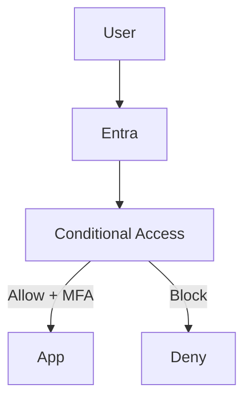

# Conditional Access Design

## 1. 目的
本ドキュメントは、Microsoft Entra ID における Conditional Access（CA）の設計方針およびポリシー内容を定義する。

本設計では、SSO と組み合わせて Zero Trust を実現するため、以下を目的とする。

- 認証の強化（MFA）
- リスクベース制御
- アプリケーション単位のアクセス制御
- 管理者アクセスの保護

---

## 2. 設計方針

- すべての認証は Entra ID を起点とする
- SSO（OIDC / SAML）と CA を組み合わせる
- 「段階的適用（Report-only → Enforce）」を前提とする
- 管理者と一般ユーザーでポリシーを分離する
- 最小影響で最大効果を得る構成を採用する

---

## 3. 対象アプリケーション

| アプリ | プロトコル | 用途 |
|---|---|---|
| Grafana | OIDC | 検証 / 可視化 |
| ServiceNow | SAML | ITSM / 業務 |

---

## 4. ポリシー一覧

### 4.1 CA-Grafana-MFA

| 項目 | 内容 |
|---|---|
| 対象 | Grafana |
| 条件 | すべてのユーザー |
| 制御 | MFA 必須 |
| 状態 | Report-only → 有効化 |

#### 設計意図
- Grafana は管理系ツールのため認証強度を上げる
- 段階的に適用し、影響を確認する

---

### 4.2 CA-ServiceNow-MFA

| 項目 | 内容 |
|---|---|
| 対象 | ServiceNow |
| 条件 | すべてのユーザー |
| 制御 | MFA 必須 |
| 状態 | Report-only |

#### 設計意図
- 業務システムのため、影響を見ながら適用
- 段階的ロールアウトを想定

---

### 4.3 CA-Admin-Strict

| 項目 | 内容 |
|---|---|
| 対象 | 管理者ロール |
| 条件 | すべてのサインイン |
| 制御 | MFA + 条件強化 |
| 状態 | 有効 |

#### 設計意図
- 管理者は最も厳しい制御
- 侵害時の影響を最小化

---

## 5. 適用フロー

## 6. 運用方針

- 初期は Report-only で検証
- 問題なければ Enforce へ移行
- 影響範囲は evidence に記録
- ポリシー変更は Pull Request ベースで管理（将来）

## 7. 証跡として残す内容

- CA ポリシー画面（スクショ）
- MFA トリガー画面
- レポート専用モード結果
- サインインログ（成功 / 失敗）
- 条件一致ログ

## 8. 設計の価値

本設計により、以下を実現する。

- SSO + MFA による認証強化
- Zero Trust の基礎構築
- 実務に近いアクセス制御の再現
- 認証ログの可視化と分析基盤

