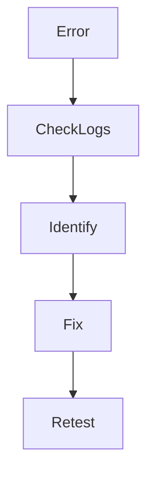

# SSO Troubleshooting Guide

## 1. 目的
本ドキュメントは、SSO（OIDC / SAML）におけるトラブルシュート手順を整理する。

Grafana（OIDC）および ServiceNow（SAML）において発生しやすい問題と対処をまとめる。

---

## 2. OIDC（Grafana）トラブル

### 2.1 ログインできない

#### 原因
- リダイレクトURL不一致
- Client ID / Secret誤り

#### 対処
- Entra ID の Redirect URI を確認
- Grafana の設定値を再確認

---

### 2.2 ユーザー情報が取得できない

#### 原因
- claim マッピングミス

#### 対処
- userPrincipalName / email を確認
- Grafana の設定を修正

---

### 2.3 MFAが動作しない

#### 原因
- Conditional Access 未適用
- 対象ユーザーが条件外

#### 対処
- CAポリシー確認
- 対象グループ確認

---

## 3. SAML（ServiceNow）トラブル

### 3.1 ログイン後にエラー

#### 原因
- NameID 不一致
- User Field 設定ミス

#### 対処
- email / UPN の整合性確認
- ServiceNow 設定見直し

---

### 3.2 ユーザーが作成されない

#### 原因
- 自動プロビジョニング未設定

#### 対処
- SCIM or 手動ユーザー作成

---

## 4. 共通トラブル

### 4.1 認証ループ

#### 原因
- Cookie / セッション問題
- ドメイン不一致

#### 対処
- ブラウザキャッシュ削除
- 設定再確認

---

### 4.2 ログの確認方法

確認すべきログ👇

- Entra ID Sign-in Logs
- Conditional Access Logs
- Application Logs
- Grafana Logs
- ServiceNow Logs

---

## 5. トラブル対応フロー

## 6. 設計者視点のポイント

- 「どこで失敗しているか」を切り分ける
- IdP / SP の責務を理解する
- 設定だけでなくログを見る
- 再現 → 修正 → 再検証の流れを守る

## 7. 証跡として残す

- エラー画面
- 設定差分
- 修正前後のログ
- 解決手順
