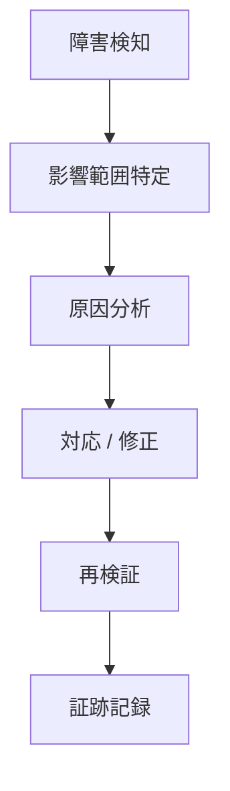

# Incident Response（インシデント対応）

## 1. 目的
本ドキュメントは、`entra-id-platform` におけるインシデント発生時の対応フローを定義する。

本設計では以下を目的とする。

- 障害時の初動対応を標準化する
- 切り分け手順を明確にする
- 対応時間を短縮する
- 証跡を確実に残す

---

## 2. 対象インシデント

本環境で想定する主なインシデントは以下。

- SSO ログイン不可
- Conditional Access によるブロック
- MFA 不具合
- Terraform 適用ミス
- Azure リソース障害

---

## 3. 対応フロー



## 4. 初動対応（最重要）

### 4.1 まず確認すること

- いつ発生したか
- 誰に影響があるか
- どのアプリで発生しているか

### 4.2 優先度判定

レベル	状態
Critical	全ユーザー影響
High	複数ユーザー
Medium	一部ユーザー
Low	単一ユーザー

## 5. 切り分け手順

### Step1：Entra ID ログ確認

```kusto
SigninLogs
| where CreatedDateTime >= ago(1h)
| order by CreatedDateTime desc
```

確認ポイント：

- ConditionalAccessStatus
- ResultType
- ResultDescription

### Step2：Conditional Access 確認

```kusto
SigninLogs
| where CreatedDateTime >= ago(1h)
| where ConditionalAccessStatus == "failure"
```

### Step3：アプリ別確認

#### Grafana（OIDC）
- Redirect URI
- Token取得

#### ServiceNow（SAML）
- NameID
- 証明書

### Step4：変更履歴確認

AuditLogs
| where TimeGenerated >= ago(24h)
| where ActivityDisplayName contains "Conditional Access"

## 6. 代表的な障害パターン

### 6.1 ログイン不可
原因	対応
CA設定ミス	ポリシー確認
MFA未設定	ユーザー登録

### 6.2 MFAが動かない
原因	対応
CA未適用	ポリシー確認
対象外	グループ確認

### 6.3 SAMLエラー
原因	対応
NameID不一致	属性修正
証明書期限切れ	更新

### 6.4 Terraformミス

原因	対応
誤apply	rollback
state不整合	再同期

## 7. 復旧後チェック

- SSO正常動作確認
- MFA確認
- ログ正常確認
- 影響ユーザー確認

## 8. 証跡として残す

- エラー画面
- KQL結果
- 修正前後設定
- GitHub Actionsログ

## 9. 再発防止

- 原因分析（Why）
- 設定改善
- Runbook更新

## 10. 設計意図

本ドキュメントにより以下を実現する。

- 障害時の迅速対応
- ログベースの分析
- 再発防止の仕組み化


