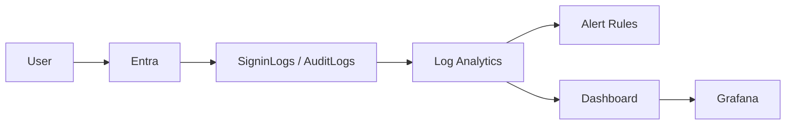

# Monitoring Design（監視設計）

## 1. 目的
本ドキュメントは、`entra-id-platform` における監視設計を定義する。

本設計では以下を目的とする。

- 障害の早期検知
- SLOの測定
- ログの可視化
- インシデント対応の迅速化

---

## 2. 監視対象

| 項目 | 内容 |
|------|------|
| 認証ログ | SigninLogs |
| CAログ | Conditional Access |
| 操作ログ | AuditLogs |
| インフラ | Azure Activity |
| CI/CD | GitHub Actions |

---

## 3. 監視構成



## 4. Azure Monitor

### 4.1 Log Analytics

収集対象：

- SigninLogs
- AuditLogs
- Activity Logs

### 4.2 アラート設計

認証失敗急増

```kusto
SigninLogs
| where CreatedDateTime >= ago(5m)
| where ResultType != 0
| summarize count()
```

条件：

5分で10件以上

## CA failure

```kusto
SigninLogs
| where ConditionalAccessStatus == "failure"
```

### 管理者ログイン

```kusto
SigninLogs
| where UserPrincipalName contains "admin"
```

## 5. Grafana（可視化）

Grafana では以下を可視化する。

- ログイン成功率
- CA適用状況
- MFA成功率
- エラー数

## 6. ダッシュボード例

パネル例
- 認証成功率（％）
- ログイン数
- CA適用数
- エラー数

## 7. 通知設計
イベント	通知
認証失敗急増	即通知
CA failure	即通知
管理者ログイン	監査

## 8. 設計意図

本設計により以下を実現する。

- 障害の早期検知
- SLO測定
- 可観測性の向上
- 運用負荷軽減

